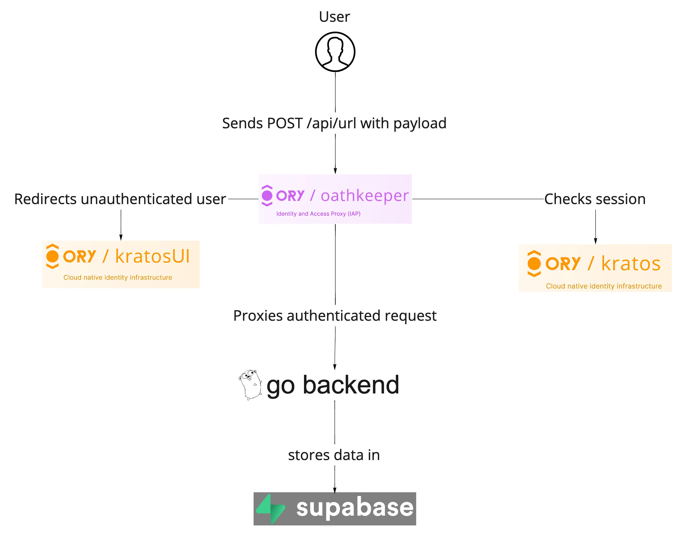
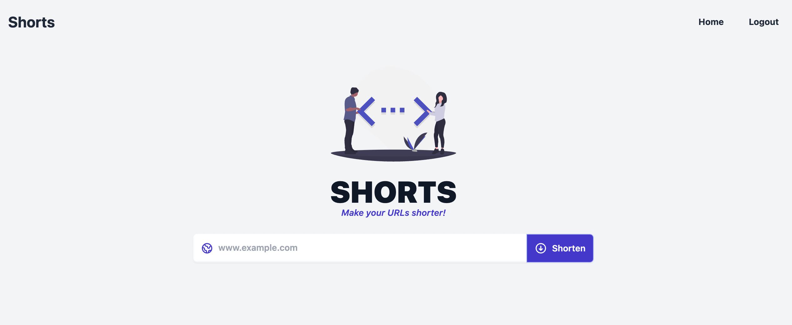
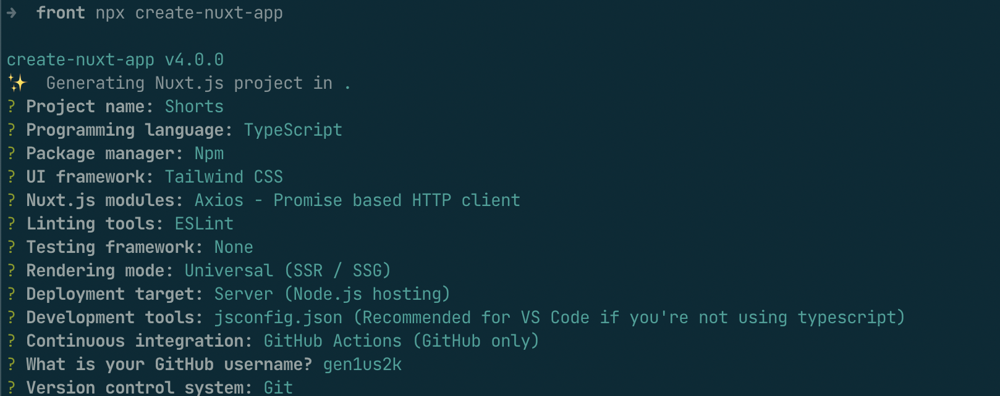

import CodeFromRemote from '../../components/freestanding/utils/codefromremote'

[The previous blog post](https://www.ory.sh/tutorial-url-shortener-supabase-ory-integration-backend/)
covers the implementation of the backend for the showcase using Ory and
Supabase. Here's an overview of the backend architecture we built in the
previous post including [Ory Kratos](https://github.com/ory/kratos),
[Supabase](https://supabase.com/docs), and
[Ory Oathkeeper](https://github.com/ory/oathkeeper):



This article will show you an example of building a front-end for our URL
shortener to complete the project. Here's the end result:



You can find the full backend and frontend source code for this project
[on GitHub](https://github.com/ory/examples/blob/master/kratos-keto-oathkeeper-supabase).

_Let's start hacking!_

## What we will use

- [Nuxt](https://nuxtjs.org/) is an open source framework built on Vue.js.
  Vue.js is an open-source
  [model–view–viewmodel](https://whatis.techtarget.com/definition/Model-View-ViewModel)
  front end JavaScript framework for building user interfaces and single-page
  applications.
- [TailwindCSS](https://tailwindcss.com/) is basically a utility-first CSS
  framework for rapidly building custom user interfaces. It is a highly
  customizable, low-level CSS framework that gives you all of the building
  blocks you need to build bespoke designs without any annoying opinionated
  styles you have to fight to override.
- [Axios](https://github.com/axios/axios) In a nutshell, Axios is a Javascript
  library used to make HTTP requests from node.js or XMLHttpRequests from the
  browser that also supports the
  [ES6 Promise API](https://developer.mozilla.org/en-US/docs/Web/JavaScript/Reference/Global_Objects/Promise).

I chose these products to build a frontend because of their simplicity. It's
easier to build frontend apps today because React, Next, Vue and Nuxt frameworks
exist with built-in [es6](https://www.w3schools.com/js/js_es6.asp) feature
compatibility in the browser. I started building JS apps in 2013 and quit in
2015 because I had a bad experience with ES5 and backbone. I needed to write a
lot of boilerplate code to add new CRUD views for any new datatype for my
backbone application. Nowadays it became easier with project generators and
useful frameworks. You can concentrate on writing code without useless actions
like copying and pasting boilerplate code.

We will use the following parts of the NuxtJS framework:

- [Store](https://nuxtjs.org/docs/directory-structure/store/)
- [Layout](https://nuxtjs.org/docs/directory-structure/layouts)
- [Pages](https://nuxtjs.org/docs/directory-structure/pages)
- [Components](https://nuxtjs.org/docs/directory-structure/components)

## Creating layout for our application

We will use the default layout created by
[create-nuxt-app](https://github.com/nuxt/create-nuxt-app). The code of
`layouts/default.vue` is simple. I took the basic example of the URl shortener
frontend from
[jonathanjameswilliams26 URL Shortener](https://github.com/jonathanjameswilliams26/UrlShortener/tree/master/Frontend)
project.

```bash
mkdir client
cd client
npx create-nuxt-app
```

Use the following settings to create the starter application:



<CodeFromRemote
  src="https://github.com/ory/examples/blob/master/kratos-keto-oathkeeper-supabase/client/layouts/default.vue"
  lang="tsx"
/>

We need to have a simple layout with an application header with Sign-in/Sign-up
buttons for unauthenticated user. Let's create the `AppHeader` component and add
it to our layout. Create `components/AppHeader.vue` file with the following
content

<CodeFromRemote
  src="https://github.com/ory/examples/blob/master/kratos-keto-oathkeeper-supabase/client/components/AppHeader.vue"
  lang="tsx"
/>

Tke a closer look at two important parts of our AppHeader:

- Usage of `computed` properties that uses the
  [`store`](https://nuxtjs.org/docs/directory-structure/store/) feature of Nuxt.
  In this case, we use the
  [Nuxt.js store features](https://nuxtjs.org/docs/directory-structure/store/),
  and create them later.
- Usage of the `$config` variable that is part of the
  [runtime configuration](https://nuxtjs.org/docs/configuration-glossary/configuration-runtime-config/)

Let's create a store for sessions for our application:

<CodeFromRemote
  src="https://github.com/ory/examples/blob/master/kratos-keto-oathkeeper-supabase/client/store/session.ts"
  lang="ts"
/>

Also, Nuxt uses
[publicRuntimeConfig](https://nuxtjs.org/docs/configuration-glossary/configuration-runtime-config/)
object for application configuration using environment variables, hence we need
to add these lines to our `nuxt.config.js`

<CodeFromRemote
  src="https://github.com/ory/examples/blob/master/kratos-keto-oathkeeper-supabase/client/nuxt.config.js"
  lang="js"
  startAt="publicRuntimeConfig: {"
  endAt="// Build Configuration: "
/>

Let's make an `URLInput` that only lets authenticated users create shortened
URls. Create a `components/URLInput.vue` file with the following content:

<CodeFromRemote
  src="https://github.com/ory/examples/blob/master/kratos-keto-oathkeeper-supabase/client/components/URLInput.vue"
  lang="tsx"
/>

## Building everything together

We do not call Kratos APIs yet, and we need to make two API calls:

- [toSession](https://www.ory.sh/docs/kratos/reference/api#operation/revokeSession)
  to check if the user session is valid
- [Create a Logout URL for Browsers](https://www.ory.sh/docs/kratos/reference/api#operation/createSelfServiceLogoutFlowUrlForBrowsers)

Let's create a `pages/index.vue` file with the following content

<CodeFromRemote
  src="https://github.com/ory/examples/blob/master/kratos-keto-oathkeeper-supabase/client/pages/index.vue"
  lang="ts"
/>

`asyncData` is a hook for
[universal data fetching](https://nuxtjs.org/docs/features/data-fetching/) in
Nuxt.js. Unlike fetch, which requires you to set properties on the component
instance (or dispatch [Vuex actions](https://vuex.vuejs.org/guide/actions.html))
to save your async state. Nuxt waits for the asyncData hook to be finished
before navigating to the next page or display the error page.

We commit the fetched data to our store and make it available for all our
components once we get the result of async API calls.

## Displaying shortened URLs component

Let's create a `components/URLView.vue` with the following content:

<CodeFromRemote
  src="https://github.com/ory/examples/blob/master/kratos-keto-oathkeeper-supabase/client/components/URLView.vue"
  lang="tsx"
/>

Run `npm run dev` to run the example locally.

You can find the full backend and frontend source code for this project
[on the Ory example repository](https://github.com/ory/examples/blob/master/kratos-keto-oathkeeper-supabase).

## Next steps

- Move Kratos API calls to
  [middleware](https://nuxtjs.org/docs/directory-structure/middleware/)/[plugins](https://nuxtjs.org/docs/directory-structure/plugins)
  directory. That would be the best place for this code.
- Add more pages with analytical information (for example Views,Top Referrals,
  or Highcharts.js graphs).
- Go to production with free tiers of the following services:
  - [Ory Cloud](https://ory.sh/cloud)
  - [Supabase](https://supabase.com)
  - [Vercel](https://vercel.com) or [Netlify](https://www.netlify.com) for
    frontend
