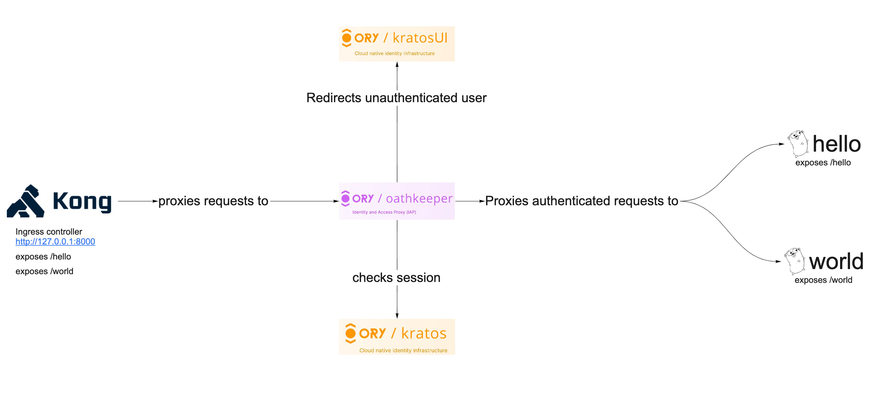

import CodeFromRemote from '../../components/freestanding/utils/codefromremote'

Microservice architecture is nowadays almost a standard for backend development.
An API gateway is an excellent way to connect a group of microservices to a
single API accessible to users. API gateways are available from cloud providers
such as AWS/Azure/Google Cloud Platform and Cloudflare. Kong is a scalable API
gateway built on open source and as such can be an excellent alternative if you
don't want to have your system locked in to a particular vendor.

This tutorial shows an example using Kong API gateway,
[Ory Kratos](https://www.ory.sh/docs/kratos), and
[Ory Oathkeeper](https://www.ory.sh/docs/oathkeeper). The illustration below
shows you the final architecture we are going to build in this guid



[The full source code for this tutorial is available on GitHub](https://github.com/gen1us2k/kong_showcase).

## What we will use

- [Kong](https://konghq.com/) gateway can be an excellent solution for an
  ingress load balancer and API gateway if you do not want vendor lock-in of any
  cloud API Gateways in your application. Kong uses
  [OpenResty](https://openresty.org/en/) and Lua. OpenResty extends Nginx with
  Lua scripting to use Nginx's event model for non-blocking I/O with HTTP
  clients and remote backends like PostgreSQL, Memcached, and Redis. OpenResty
  is not an Nginx fork, and Kong is not an Openresty fork. Kong uses OpenResty
  to enable
  [API gateway features](https://microservices.io/patterns/apigateway.html).
- [Oathkeeper](https://ory.sh/docs/oathkeeper) acts like an identity and access
  proxy for our microservices. It allows to proxy only authenticated requests to
  our microservices, and so we don't need to implement a middleware to check
  authentication. It can also transform requests, for example convert session
  auth into JWT for a back-end service.
- [Kratos](https://ory.sh/docs/kratos) is the authentication provider; it
  handles all first-party authentication flows: username/password, forgot
  password, MFA/2FA, [and more](https://www.ory.sh/docs/kratos/self-service). It
  also provides OIDC/social login capabilities for example "Login with GitHub".

## Building simple microservices

Let's say we have two microservices: `hello` and `world`. They are pretty simple
and serve only to test our API gateway, but you can switch them out for more
complex components.

The "World" microservice exposes a `/world` API endpoint and returns a simple
JSON message:

<CodeFromRemote
  src="https://github.com/gen1us2k/kong_showcase/blob/master/world/main.go"
  lang="go"
/>

The "Hello" microservice exposes a `/hello` API endpoint and returns a simple
JSON message:

<CodeFromRemote
  src="https://github.com/gen1us2k/kong_showcase/blob/master/hello/main.go"
  lang="go"
/>

We now want to secure the access to these microservices and let only
authenticated users access these endpoints.


_Okay. Let's start hacking, shall we?_

## Ory Kratos setup

Follow the [Quickstart](https://www.ory.sh/docs/kratos/quickstart) guide to set
up Ory Kratos. In this tutorial you only need a docker-compose file with the
following configuration:

<CodeFromRemote
  src="https://github.com/gen1us2k/kong_showcase/blob/master/docker-compose.yml"
  lang="yaml"
  startAt="postgres-kratos:"
/>
Some notes on the network architecture:

- HTTP `:4433` and `:4434` are the public and admin API's of Ory Kratos.
- HTTP `:4436` for Mailslurper - a mock Email server. You can get an activation
  link by accessing http://127.0.0.1:4436.
- HTTP `:4455` for the UI interface that allows one to start
  sign-up/login/recovery flows.

After running `docker-compose up` you can open `http://127.0.0.1:4455/welcome`
to test your configuration.

## Configuring Ory Oathkeeper

Now we can start configuring our gateways for this example. Kong is the entry
point for the network traffic. Ory Oathkeeper would be accessible from the
internal network only in this case. Let's review our architecture diagram from
before:


Oathkeeper checks sessions and proxies traffic to our microservice while Kong
provides ingress load balancing. We can even set up
[Round-Robin DNS](https://en.wikipedia.org/wiki/Round-robin_DNS) to have a more
robust configuration for our service. Here is how we configure the access rules
for Ory Oathkeeper:

<CodeFromRemote
  src="https://github.com/gen1us2k/kong_showcase/blob/master/oathkeeper/access-rules.yml"
  lang="yaml"
/>

The Ory Oathkeeper configuration:

<CodeFromRemote
  src="https://github.com/gen1us2k/kong_showcase/blob/master/oathkeeper/oathkeeper.yml"
  lang="yaml"
/>

Ory Oathkeeper now looks up a valid session in the request cookies, and proxies
only authenticated requests. It redirects to login UI if there's no
`ory_kratos_session` cookie available.

## Adding Kong

Now all that is needed is to configure Kong:

<CodeFromRemote
  src="https://github.com/gen1us2k/kong_showcase/blob/master/docker-compose.yml"
  lang="yaml"
  startAt="services:"
  endAt="hello"
/>

The docker-compose creates three containers

- db container with PostgreSQL database to store the configuration of
  services/routes for our API gateway.
- kong-migrate to run migrations against the database.
- kong container that exposes `8000` port for proxying traffic and `8001` port
  with admin API.

As last step, we need to create a service for Kong and configure routes.

```bash
#!/bin/bash

# Creates an secure-api service
# and proxies network traffic to oathkeeper
curl -i -X POST \
  --url http://localhost:8001/services/ \
  --data 'name=secure-api' \
  --data 'url=http://oathkeeper:4455'

# Creates routes for secure-api service
curl -i -X POST \
  --url http://localhost:8001/services/secure-api/routes \
  --data 'paths[]=/'\
```

## Testing

You can open `http://127.0.0.1:8000/hello` or `http://127.0.0.1:8000/world` in
your browser and there are two possible scenarios:

- You receive `{"message": "Hello microservice"}` (or `"World microservice"`).
- The browser redirects you to http://127.0.0.1:4455/login.

## Further steps

- [Configure](https://www.ory.sh/docs/kratos/guides/zero-trust-iap-proxy-identity-access-proxy)
  `id_token` mutator to have the identity accessible as JWT token for your
  microservices.
- [Configure](https://www.ory.sh/docs/kratos/guides/password-policy) the
  password policy to better suit your use case.
- [Add two-factor authentication](https://www.ory.sh/docs/kratos/guides/two-factor-authentication-2fa-mfa).
- Consider using
  [authentication based on subrequest result](https://docs.nginx.com/nginx/admin-guide/security-controls/configuring-subrequest-authentication/)
  instead of having an additional reverse proxy inside your network.
- [Kong auth request](https://github.com/ascho/kong-auth-request) can be an
  excellent plugin to use Ory Oathkeeper as a decision API for Kong.
